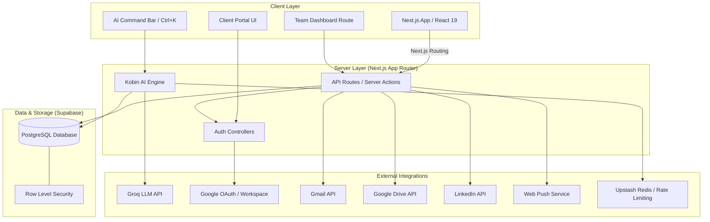
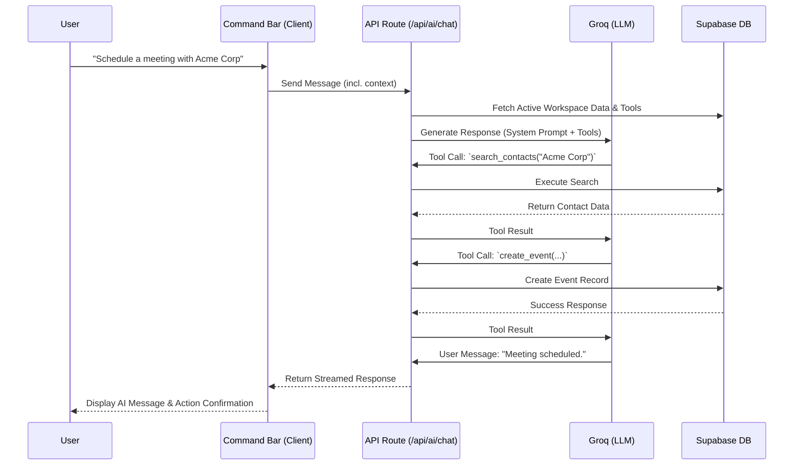
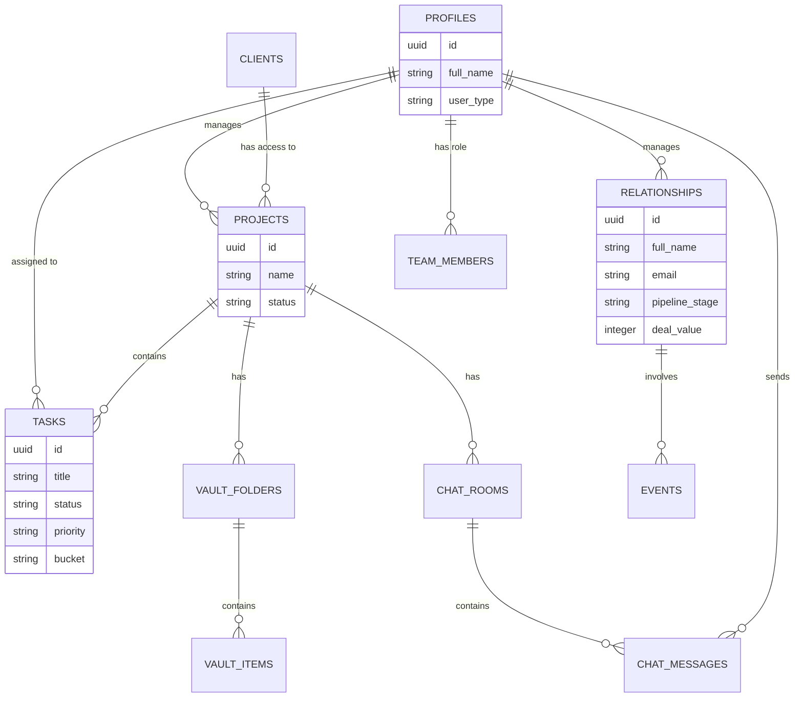
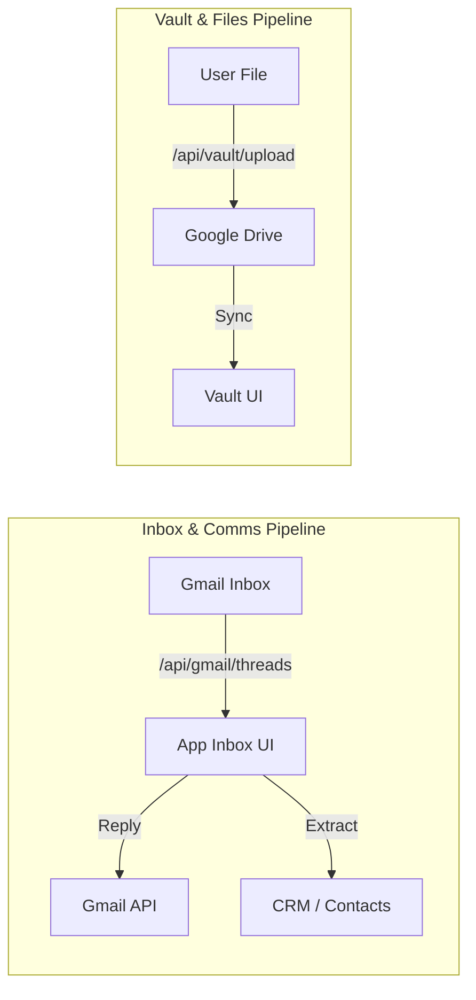

# Founder Assistant - System Architecture

This document outlines the high-level system architecture, data models, and critical workflows for the Founder Assistant platform.

## High-Level Architecture

The application is built on a modern Next.js stack, leveraging Supabase for backend services, Groq for AI processing, and various external APIs for integrations.

## AI Agent Architecture (Kobin)

The Kobin AI Operating Layer uses an MCP-style tool architecture for proactive workspace management.

## Core Data Model

The application uses Supabase (PostgreSQL) with Row Level Security for multi-tenancy and permissions.

## Integration Data Flow

