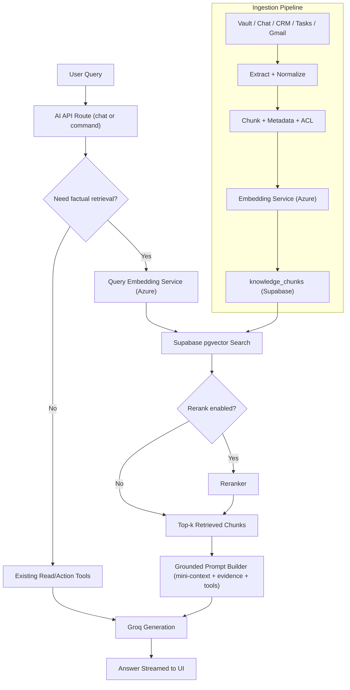

# RAG Architecture Plan for Founder-Assistant

## 1) Executive Summary

The current AI stack in this repository is a strong **tool-augmented assistant architecture**, but it is **not yet a full Retrieval-Augmented Generation (RAG) pipeline**. It relies on:

- Prompted mini-context generation
- Read/action tool-calling against operational tables
- Rule-based memory snippets
- Direct model responses (Groq)

To make the assistant faster, more accurate on historical questions, and less hallucinatory at scale, we should add a dedicated retrieval substrate:

1. Ingestion + chunking
2. Embedding generation
3. Vector storage + ANN search in Supabase
4. Optional reranking
5. Evidence-grounded response generation

Given the requirement to avoid external paid APIs, and availability of Azure credits, the recommended approach is:

- **Supabase pgvector** for vector DB
- **Self-hosted open embedding model on Azure** for embedding generation

---

## 2) Current Architecture (Codebase Reality)

### 2.1 AI Request Entry Points

- `app/api/ai/chat/route.ts`  
  Conversational assistant endpoint with read-tool loop and SSE streaming.
- `app/api/ai/command/route.ts`  
  Agentic action endpoint with read/action tool orchestration and mutation safety.

### 2.2 Core AI Modules

- `lib/ai/groq.ts`  
  Groq model setup and model tier defaults.
- `lib/ai/model-router.ts`  
  Message complexity based routing (fast/std/strong).
- `lib/ai/mini-context.ts`  
  Fast, structured snapshot of workspace state.
- `lib/ai/mcp-read-tools.ts`  
  On-demand fetch tools for tasks/projects/crm/calendar/vault/contacts.
- `lib/ai/tools.ts` + `lib/ai/action-executor.ts`  
  Action schema + execution (create/update/delete task/project, search messages, etc.).
- `lib/ai/intelligence.ts`  
  Rule-based risk analysis and prioritization.
- `lib/ai/memory.ts`  
  Lightweight long-term memory layer backed by `ai_memories` table references.

### 2.3 Data and Access Layer

- Supabase service role client for server routes: `lib/supabase/admin.ts`
- SSR auth client: `lib/supabase/server.ts`
- Optional Redis caching with graceful fallback: `lib/redis.ts`

---

## 3) Current Limitations (Why RAG is Needed)

### Limitation A — No semantic retrieval layer

Current lookup methods are mostly structured SQL and keyword matching (`ilike`). This fails for:

- synonym queries
- paraphrased questions
- fuzzy “what did we decide about X?” questions

### Limitation B — No vector schema or ANN index migrations

Current SQL scripts in `scripts/*.sql` do not define:

- `vector` extension setup
- chunk storage tables
- HNSW/IVFFlat vector indexes
- similarity RPC functions

### Limitation C — Ingestion/indexing path is missing

No pipeline currently transforms operational content into retrievable knowledge chunks.

### Limitation D — Schema drift between repository migrations and deployed database

The provided full database snapshot includes `ai_memories`, expanded CRM/Gmail tables, and richer chat/task structures, while repository migration files under `scripts/` are older and incomplete relative to runtime expectations.

This creates onboarding and portability risk (new environments may not match production behavior unless schema parity is restored).

### Limitation E — No evidence-grounded response contract

Prompts do not enforce mandatory source-backed generation for factual answers, making attribution weaker than ideal.

### Limitation F — No retrieval quality harness

No measurable retrieval evaluation currently exists (Recall@k, groundedness, MRR, latency budgets).

---

## 4) Embedding Strategy (No external paid API)

## Recommended Strategy

Use **open-source embedding models hosted on Azure infrastructure** so credits cover compute, while avoiding third-party paid embedding APIs.

## Candidate Models

### Option 1 (Recommended start): `BAAI/bge-small-en-v1.5`

- Strong quality/latency ratio
- Lower embedding dimension and cost footprint
- Good for English-heavy startup/agency workflows

### Option 2: `BAAI/bge-m3`

- Better multilingual capability
- Heavier compute requirements

### Option 3: `mixedbread-ai/mxbai-embed-large-v1`

- Higher quality potential
- Higher latency/cost per query

## Hosting Options on Azure

1. Azure ML managed online endpoint
2. Azure Container Apps / AKS with TEI or custom inference server
3. Azure AI model deployment (if compatible with your constraints)

---

## 5) Target RAG Pipeline Design

## 5.1 Ingestion Sources

- `vault_items` (docs/notes/links)
- `chat_messages`
- `tasks.notes` and task artifacts
- `relationships.pipeline_notes` and CRM context
- optional: Gmail thread content

## 5.2 Chunking Design

- Chunk size: 300–800 tokens (start ~500)
- Overlap: 10–20%
- Metadata attached to each chunk:
  - `founder_id`
  - source type (`vault`, `chat`, `task`, `crm`, `gmail`)
  - source row id
  - project id (if available)
  - ACL scope tags (founder/team/client)
  - timestamps

## 5.3 Embedding Flow

- Batch embed new/changed chunks
- Upsert embeddings to Supabase
- Deduplicate by stable hash
- Re-embed on content changes

## 5.4 Retrieval Flow

1. Query embedding
2. Metadata pre-filter (tenant/project/permissions)
3. Vector top-k search (e.g., 30)
4. Optional rerank to top-n (e.g., 8)
5. Inject compact evidence bundle into final LLM prompt

## 5.5 Response Grounding

- Model must cite source snippets internally (for UI/source rendering)
- If evidence confidence is low, assistant should explicitly abstain or ask one precise follow-up

---

## 6) Visual Map (End-to-End)

---

## 7) Proposed Supabase Schema Additions

Create a new migration (example: `scripts/005_rag_schema.sql`) with:

1. `create extension if not exists vector;`
2. `knowledge_chunks` table:
   - `id uuid`
   - `founder_id uuid`
   - `source_type text`
   - `source_id uuid/text`
   - `project_id uuid nullable`
   - `chunk_text text`
   - `chunk_hash text unique per founder/source`
   - `embedding vector(<dim>)`
   - `metadata jsonb`
   - `created_at`, `updated_at`
3. RLS policies that preserve current founder/team/client scope boundaries
4. ANN index:
   - HNSW + cosine operator class (recommended start)
5. Retrieval RPC:
   - `match_knowledge_chunks(query_embedding, founder_id, top_k, filters)`

---

## 8) Integration Plan by Phase

## Phase 1 — Foundation (Week 1)

- Add vector schema + retrieval RPC
- Deploy first embedding endpoint on Azure
- Build `lib/ai/retrieval/` interfaces (`embed.ts`, `search.ts`)
- Backfill small corpus (vault + recent chat)

## Phase 2 — Pipeline (Week 2)

- Build ingestion workers + chunker + dedupe
- Integrate retrieval into `app/api/ai/chat/route.ts`
- Add confidence thresholds and fallback to existing tools

## Phase 3 — Quality (Week 3)

- Optional reranking stage
- Add grounded-output response format with source refs
- Build eval harness (Recall@k, MRR, groundedness)

## Phase 4 — Production Rollout (Week 4)

- Shadow mode first
- Compare retrieval-enhanced vs baseline answer quality
- Gradual enablement by workspace/user cohort
- Monitor latency and costs continuously

---

## 9) Expected Effects

## Accuracy

- Large improvement for historical/contextual queries
- Better answer consistency across long-lived workspace memory

## Latency

- + retrieval overhead per query (embedding + vector search)
- but lower repeated broad SQL/tool fanout for semantic lookups

## Cost

- Azure compute for embedding service (covered by credits)
- Supabase storage/index costs for chunk corpus
- lower dependency on paid external APIs

## Safety/Trust

- Better evidence-grounding and attribution
- Lower hallucination rate for workspace-specific questions

---

## 10) Risks and Mitigations

1. **Index growth and storage bloat**  
   Mitigation: dedupe hashes, retention policies, compact metadata.

2. **Stale knowledge after updates**  
   Mitigation: change-data-capture reindex hooks and backfill jobs.

3. **Permission leakage risk**  
   Mitigation: strict ACL metadata + RLS + retrieval filter enforcement.

4. **Latency spikes under load**  
   Mitigation: batching, caching, async precompute, autoscaling endpoint.

---

## 11) Implementation Task Stubs

task-stub{title="Create Supabase pgvector schema for RAG chunks and retrieval"}
Add a migration that enables `vector`, creates `knowledge_chunks`, applies RLS-compatible tenant filters, builds HNSW cosine index, and adds a `match_knowledge_chunks` RPC for top-k retrieval with metadata filtering.

task-stub{title="Implement Azure-hosted embedding service adapter"}
Create provider-agnostic embedding interface in `lib/ai/retrieval/embed.ts`, implement Azure endpoint client with batching/retries/timeouts, and support model config via env vars for easy A/B swaps.

task-stub{title="Build ingestion and chunking pipeline across workspace entities"}
Create extractors for vault/chat/tasks/crm, implement chunking + overlap + metadata tagging + ACL annotations, dedupe by chunk hash, and upsert embeddings to `knowledge_chunks`.

task-stub{title="Integrate retrieval stage into chat and command AI routes"}
Before generation in `app/api/ai/chat/route.ts` and `app/api/ai/command/route.ts`, run query embedding + vector search + optional rerank, then inject top evidence blocks into prompt with strict token budget.

task-stub{title="Add grounded response contract and source attribution"}
Update prompts and response shaping so factual responses rely on retrieved evidence and return source metadata suitable for UI display, with abstain/follow-up behavior when confidence is low.

task-stub{title="Create canonical schema baseline migration matching deployed DB"}
Create a canonical migration set that reflects the full deployed schema (including `ai_memories`, Gmail entities, richer chat/task/client structures, and related constraints), then mark legacy migrations as superseded to prevent environment drift.

task-stub{title="Add retrieval evaluation harness and rollout guardrails"}
Implement offline eval suite for Recall@k/MRR/groundedness, runtime telemetry for hit-rate/latency, and feature-flag rollout with shadow mode comparison against baseline behavior.

---

## 12) Primary References

- Supabase pgvector extension docs: https://supabase.com/docs/guides/database/extensions/pgvector
- Supabase vector indexes docs: https://supabase.com/docs/guides/ai/vector-indexes
- Supabase AI production guidance: https://supabase.com/docs/guides/ai/going-to-prod
- Azure AI model catalog overview: https://learn.microsoft.com/en-us/azure/ai-studio/how-to/model-catalog-overview
- Azure embeddings inference guidance: https://learn.microsoft.com/en-us/azure/ai-foundry/model-inference/how-to/use-embeddings
- Azure OpenAI embeddings concepts: https://learn.microsoft.com/en-us/azure/ai-foundry/openai/concepts/understand-embeddings
- Hugging Face model cards:
  - https://huggingface.co/BAAI/bge-small-en-v1.5
  - https://huggingface.co/BAAI/bge-m3
  - https://huggingface.co/mixedbread-ai/mxbai-embed-large-v1
  - https://huggingface.co/nomic-ai/nomic-embed-text-v1.5

## 13) Schema Alignment Update (Based on Provided Full DB SQL)

The RAG plan has been updated to reflect your provided database snapshot. Key implications:

1. **`ai_memories` already exists in deployed schema**
   - Keep the memory feature in scope.
   - Focus work on migration parity rather than creating net-new memory tables.

2. **RAG should integrate with already-rich entities**
   - Chat: `chat_messages`, `chat_rooms`, `chat_room_members`, `message_reactions`
   - CRM: `relationships`, `email_analyses`, `gmail_threads`, `gmail_messages`
   - Work management: `tasks`, `task_comments`, `projects`
   - Knowledge: `vault_items`, `vault_folders`, `vault_notes`

3. **Recommended chunk-source priority (using your actual schema)**
   - Tier 1: `vault_items` (files/notes/links), `chat_messages`, `tasks.notes`, `relationships.pipeline_notes`
   - Tier 2: `gmail_threads.subject/snippet`, `gmail_messages.body_text`, `email_analyses.reasoning/signals`
   - Tier 3: meeting/event summaries from `events`, `team_meetings`

4. **Metadata filters should include your real keys**
   - Tenant scope: `founder_id`
   - Context scope: `project_id`, `room_id`, `relationship_id`, `client_id`
   - Source lineage: table + primary key
   - Access scope tags aligned with founder/team/client visibility rules

5. **Migration strategy should be two-track**
   - Track A: Canonical baseline from deployed schema (authoritative).
   - Track B: New RAG migrations (`vector`, `knowledge_chunks`, retrieval RPC, indexes, RLS).

This approach prevents breaking current functionality while adding RAG capabilities safely.
